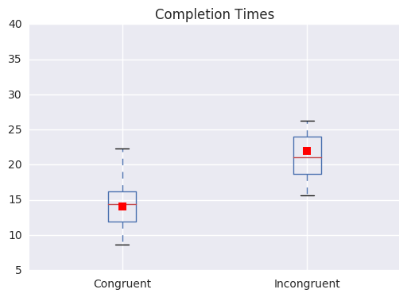
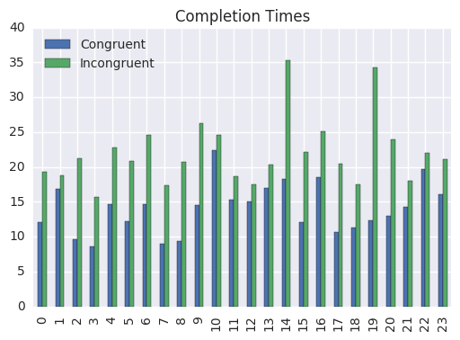

<script>
  function code_toggle() {
    if (code_shown){
      $('div.input').hide('500');
      $('#toggleButton').val('Show Code')
    } else {
      $('div.input').show('500');
      $('#toggleButton').val('Hide Code')
    }
    code_shown = !code_shown
  }

  $( document ).ready(function(){
    code_shown=false;
    $('div.input').hide()
  });
</script>
<form action="javascript:code_toggle()"><input type="submit" id="toggleButton" value="Show Code"></form>
###### Student: Gerardo Alfredo Alarcon Rivas

# Project 1: Test a Perceptual Phenomenon
In psychology, the Stroop effect is a demonstration of interference in the reaction time of a task. When the name of a color (e.g., "blue", "green", or "red") is printed in a color that is not denoted by the name (e.g., the word "red" printed in blue ink instead of red ink), naming the color of the word takes longer and is more prone to errors than when the color of the ink matches the name of the color. The effect is named after John Ridley Stroop, who first published the effect in English in 1935.[1] The effect had previously been published in Germany in 1929.[2][3][4] The original paper has been one of the most cited papers in the history of experimental psychology, leading to more than 701 replications.[4] The effect has been used to create a psychological test (Stroop test) that is widely used in clinical practice and investigation.
#### 1. What is our independent variable? What is our dependent variable?


-Dependent variable: Time to name the font color.
-Independent: is weather the name match the color or the color not match the name.
#### 2. What is an appropriate set of hypotheses for this task? What kind of statistical test do you expect to perform? Justify your choices


Hypothesis test

H0(Null Hypothesis):  μC = μI

-Mean time to name colours is the same for congruent and incongruent tasks.

HA(Alternate Hypothesis):μC ≠ μI 

-Mean time to name colours is not the same for congruent and incongruent tasks.

Where μ is a population mean, the subscript "C" represents the congruent words condition, and the subscript "I" represents the incongruent words condition

We can use a two-sided paired student T-test to test the hypotesis due  we don´t know the population standard deviation, our sample is below 30 and also we are evaluating the difference between the means of μC and μI to know if the mean time of incongruent tasks vs congruent tasks are the same.
#### 3. Report some descriptive statistics regarding this dataset. Include at least one measure of central tendency and at least one measure of variability.


```python
import pandas as pd
import numpy as np
df= pd.read_csv("\\stroopdata_2.csv")
df.head()
R=df.describe()
print(R[1:3])
```

          Congruent  Incongruent
    mean  14.051125    22.015917
    std    3.559358     4.797057
    

#### 4. Provide one or two visualizations that show the distribution of the sample data. Write one or two sentences noting what you observe about the plot or plots.


```python
%matplotlib inline
import matplotlib

df.plot.box(title='Completion Times',showmeans=True);
```





```python
df.plot(title='Completion Times',kind='bar');
```




-Congruent answer are completed faster than incongruent answers.
#### 5. What is your confidence level and your critical statistic value? Do you reject the null hypothesis or fail to reject it? Come to a conclusion in terms of the experiment task. Did the results match up with your expectations?.


df: 23
µD: -7.9648
S: 4.86482691
t-stat: -8.020706944
at α 0.05 
t-critical: +-2.06865761
P: 4.103E-08
95% CI: (-25.3527231, 9.42314)The Null hypothesis is rejected due At α 0.05 the time needed to name the colors is different between congruent answer and the incongruent answer. 
The participants of the experiment don't name the colors at the same speed when the answer is congruent than when are incongruent. 
#### 6. Optional: What do you think is responsible for the effects observed? Can you think of an alternative or similar task that would result in a similar effect? Some research about the problem will be helpful for thinking about these two questions!


Following the studies about the experiment looks like the confusion produce more time to think about the answers in the experiments due the brain take more time to match the meaning of the word with the visual information of the eyes respecting to the color due to the speed of processing between the eyes and the brain. 
I was thinking of a similar effect with the alcohol and the speed, the alcohol affects different parts of the brain, in this example the affected region is the Cerebral cortex who is in charge of processing and consciousness, we can see a similar effect than in the Stroop effect but in this case affected by a chemical change in our body, the alcohol depresses the behavioral inhibitory centers, making the person less inhibited; it slows down the processing of information from the eyes, ears, mouth and other senses; and it inhibits the thought processes, making it difficult to think clearly. So we can see that the effects are similar to the experiment, we loose the speed of processing of our senses and that is the reason that when the people is drunk have this feeling like if the world is slower.References
https://en.wikipedia.org/wiki/Stroop_effect
http://hamelg.blogspot.com/2015/11/python-for-data-analysis-part-24.html
http://pandas.pydata.org/pandas-docs/version/0.18.1/visualization.html